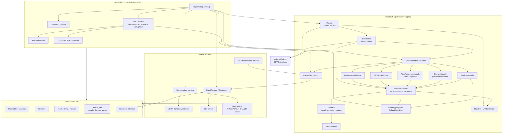

# 01 — Baseline architecture

Subject: `hgps_main`, Health-GPS 3.0.0.0, BSD-3-Clause (Imperial College London / INRAE).
All file:line references are to that tree.

Health-GPS is an agent-based microsimulation of a national population. It creates a synthetic
cohort, ages it year by year, evolves each person's risk factors, applies disease incidence,
remission and mortality, and reports aggregated burden-of-disease statistics. Its purpose is to
compare a **baseline** future against a **policy intervention** future run from the same random
seed, so the difference between the two is attributable to the policy rather than to sampling noise.

---

## 1. Subsystems and responsibilities

The build produces four static libraries and one executable.

| Target | Directory | Responsibility |
|---|---|---|
| `HealthGPS.Core` | `src/HealthGPS.Core` | Dependency-free primitives shared by everything else: `DataTable` and its typed columns, `Identifier`, `IntegerInterval`, `Array2D`, `UnivariateSummary`, maths and string helpers, the `Datastore` interface, threading helpers. |
| `HealthGPS.Input` | `src/HealthGPS.Input` | Everything that turns files into memory: JSON config parsing and JSON-Schema validation, CSV parsing, the `DataManager` back-end store, zip download/extract/cache, risk-factor model parsers. |
| `HealthGPS` | `src/HealthGPS` | The simulation engine: runtime context, modules, models, scenarios, event bus, RNG, results. |
| `HealthGPS.LibConsole` | `src/HealthGPS.Console` | CLI option parsing, the event monitor, and the result writers. |
| `HealthGPS.Console` | `src/HealthGPS.Console` | `main()`. |
| (vendored) | `src/external/adevs` | A four-header cut-down of the adevs discrete-event simulator, providing `adevs::Simulator`, `adevs::Time` and the `Atomic` model interface. |

### 1.1 Core simulation types

- **`Person`** (`person.h:39`) — one agent. Holds `gender`, `age`, `sector`, `region`,
  `ethnicity`, `income`, `income_continuous`, `physical_activity`, `ses`, a
  `std::map<Identifier,double> risk_factors`, a `std::map<Identifier,Disease> diseases`, and private
  lifecycle state (`is_alive_`, `has_emigrated_`, `time_of_death_`, `time_of_migration_`, `id_`).
  `get_risk_factor_value` (`person.cpp:57`) resolves a name against, in order: a stored `income`
  override, a static dispatcher of derived predictors (`Age`, `Age2`, `Gender`, `Region`…), the
  per-person `risk_factors` map, and finally `resolve_derived_predictor`.
- **`Population`** (`population.h:19`) — a `std::vector<Person>` with slot recycling. Dead and
  emigrated slots are reused by newborns and immigrants; person IDs are *not* reused
  (`allocate_next_person_id`, `population.h:114`).
- **`RuntimeContext`** (`runtime_context.h:22`) — the per-simulation world. Owns the `Population`,
  the `Scenario`, the metrics, the current time and run number, and — importantly — **one `Random`
  instance** (`runtime_context.h:113`). Every module reaches the RNG through `context.random()`.
- **`Simulation`** (`simulation.h`) — an adevs `Atomic` model. Owns a `RuntimeContext` and five
  module instances, and implements `init`/`update`/`fini` as DEVS state transitions.

### 1.2 Modules

Five module slots, enumerated in `interfaces.h:13`:

| `SimulationModuleType` | Concrete type | Responsibility |
|---|---|---|
| `Demographic` | `DemographicModule` (`demographic.h`) | Initial age/gender distribution from UN data; births, deaths, ageing, net migration; region and ethnicity assignment; residual mortality calibration. |
| `SES` | `SESNoiseModule` (`ses_noise_module.h`) | Draws each person's socio-economic status from a normal distribution. |
| `RiskFactor` | `RiskFactorHostModule` (`riskfactor.h`) | Hosts a *static* model (initialisation) and a *dynamic* model (year-on-year update). |
| `Disease` | `DiseaseModule` (`disease.h`) | Owns one `DiseaseModel` per configured disease; drives initialisation and yearly remission/incidence. |
| `Analysis` | `AnalysisModule` (`analysis_module.h`) | Computes all reported statistics — prevalence, incidence, YLL/YLD/DALY, costs, means and standard deviations by age/gender/income — and publishes them. |

Modules are built by `SimulationModuleFactory` (`modulefactory.cpp:21`), a
`map<SimulationModuleType, builder>` registered in `get_default_simulation_module_factory`.

### 1.3 Risk-factor models

`RiskFactorModelType` (`risk_factor_model.h:12`) has two slots, `Static` and `Dynamic`, each filled
by one of:

| Model | File | Notes |
|---|---|---|
| `StaticLinearModel` | `static_linear_model.cpp` (2,615 lines — the largest file) | The current production static model. Box-Cox / logistic two-stage factor generation, income (categorical and continuous), physical activity, region/ethnicity policy effects. |
| `StaticHierarchicalLinearModel` | `static_hierarchical_linear_model.cpp` | Older hierarchical approach; samples residual rows from an empirical matrix. |
| `DynamicHierarchicalLinearModel` | `dynamic_hierarchical_linear_model.cpp` | Year-on-year risk factor transitions with boundary-respecting normal draws. |
| `KevinHallModel` | `kevin_hall_model.cpp` (1,462 lines) | Energy-balance body-weight model; nutrient intake to weight/height trajectories. |
| `EnergyBalanceHierarchicalLinearModel` | (parsed via `model_parser.cpp`) | EBHLM variant. |
| `DummyModel` | `dummy_model.cpp` | Test/no-op model. |

Supporting pieces: `LmsModel` + `WeightModel` (BMI to weight category via LMS parameters),
`RiskFactorAdjustableModel` (calibrates simulated means to target `FactorsMean` tables),
`LinearModelEvaluator`, `PredictorResolver`, `HierarchicalMapping`.

### 1.4 Disease models

`get_default_disease_model_registry()` (`disease_registry.h:16`) maps `core::DiseaseGroup` to a
builder:

- `DiseaseGroup::other` → `DefaultDiseaseModel` (`default_disease_model.cpp`) — prevalence-based
  initialisation, then yearly remission and incidence driven by relative risks.
- `DiseaseGroup::cancer` → `DefaultCancerModel` (`default_cancer_model.cpp`) — adds
  `time_since_onset` tracking, survival-rate parameters and a prevalence distribution.

Both consume a `DiseaseDefinition` (measure tables plus relative-risk lookups) obtained from the
repository, and a `WeightModel` classifier.

### 1.5 Scenarios

`ScenarioType` (`scenario.h:17`) is `baseline` or `intervention`. The baseline is
`BaselineScenario`. Six intervention scenarios exist, all implementing `InterventionScenario`:

`SimplePolicyScenario`, `MarketingScenario`, `MarketingDynamicScenario`,
`FoodLabellingScenario`, `PhysicalActivityScenario`, `FiscalScenario`.

A scenario's job is to transform a risk-factor value at a given time for a given person
(`apply(...)`), and to hold the `SyncChannel` used to keep the two futures aligned.

### 1.6 Events and output

An `EventAggregator` (`event_bus.h`) carries polymorphic `EventMessage`s from the engine to the
host. Message types: `InfoEventMessage`, `ResultEventMessage`, `ErrorEventMessage`,
`RunnerEventMessage`, `IndividualTrackingEventMessage`. The Console's `EventMonitor`
(`event_monitor.h`) subscribes, buffers messages in `tbb::concurrent_queue`s, and drains them on
`tbb::task_group` threads into `ResultFileWriter` and (optionally)
`IndividualIDTrackingWriter`.

---

## 2. Module dependency diagram



---

## 3. Simulation lifecycle — config load to output write

```mermaid
sequenceDiagram
    autonumber
    participant U as User
    participant M as main()
    participant C as Configuration
    participant DS as DataSource
    participant DM as DataManager
    participant R as CachedRepository
    participant RN as Runner
    participant S as Simulation (per scenario)
    participant MOD as Modules
    participant B as EventBus
    participant EM as EventMonitor
    participant W as ResultFileWriter

    U->>M: HealthGPS.Console -c config.json
    M->>C: get_configuration(source, output, job_id)
    C->>C: load JSON, resolve $schema, validate against schemas/v1
    C-->>M: Configuration
    M->>M: run_async(load_datatable_from_csv, config.file)
    M->>DS: get_data_directory()
    DS->>DS: dir? use it. zip/URL? download, SHA-256, extract to cache
    DS-->>M: data directory
    M->>DM: DataManager(data_dir)
    M->>R: CachedRepository(DataManager)
    M->>R: register_risk_factor_model_definitions(static, dynamic)
    M->>DM: get_country(code), get_diseases_info()
    M->>M: table_future.get()  (input dataset CSV)
    M->>M: create_model_input(table, country, config, diseases)
    Note over M: --dry-run stops here
    M->>M: create output folder, ResultFileWriter, EventMonitor
    M->>RN: Runner(bus, MTRandom32 seeded from config)

    loop for run = 1..trial_runs
        RN->>RN: run_seed = seed_generator.next()
        par baseline thread
            RN->>S: jthread run_model_thread(baseline, run, run_seed)
        and intervention thread (only if configured)
            RN->>S: jthread run_model_thread(intervention, run, run_seed)
        end
        S->>S: setup_run(run, run_seed) → context.random().seed(run_seed)
        S->>S: adevs::Simulator.add(this); init()
        S->>MOD: initialise_population()
        Note over S,MOD: order fixed: Demographic → SES → RiskFactor → Disease → Analysis
        MOD->>B: publish(InfoEventMessage start)
        loop each year until stop_time
            S->>S: update() at t+1
            S->>MOD: demographic.update_population()  (deaths, births, ageing)
            S->>S: update_net_immigration()
            Note over S: baseline SENDS net migration on SyncChannel;<br/>intervention RECEIVES it (with sync_timeout_ms)
            S->>MOD: ses.update_population()
            S->>MOD: risk_factor.update_population()
            S->>MOD: disease.update_population()  (remission then incidence)
            S->>MOD: analysis.update_population()
            MOD->>B: publish_async(ResultEventMessage)
        end
        S->>S: fini() → publish(InfoEventMessage stop)
        RN->>RN: join both threads
    end

    B->>EM: messages queued (tbb::concurrent_queue)
    EM->>W: drain on task_group threads
    W->>W: write .json summary + .csv rows (+ per-income CSVs, + tracking CSV)
    M->>EM: event_monitor.stop()
    M-->>U: elapsed time, exit
```

**Ordering is load-bearing.** `simulation.cpp:134` and `:165` both carry the comment
`/* Note: order is very important */`, and `default_disease_model.cpp:95` carries
`// Order is very important!` before remission-then-incidence. Module order is fixed in code, not
configurable.

---

## 4. Configuration schema

Config is JSON, validated against JSON Schema 2020-12 documents shipped in `schemas/`. The
executable resolves `$schema` to a **local** copy: `schema.cpp:42` takes `get_program_directory()`
and appends the path fragment after `/schemas/`, so the network URL in `$schema` selects a local
file rather than being fetched.

`schemas/v1/config.json` requires six top-level members:

| Member | Purpose |
|---|---|
| `version` | Config format version (examples use `2`) |
| `data` | `{ "source": <dir, .zip path, or https URL>, "checksum": <sha256> }`. `source` is required. |
| `inputs` | `dataset` (CSV name, format, delimiter, encoding, column name→type map) and `settings` (`country_code`, `size_fraction`, `age_range`) |
| `modelling` | `ses_model`, `risk_factors[]` (name, level, range), `risk_factor_models` (`static`/`dynamic` → JSON files), `baseline_adjustments` (FactorsMean CSVs) |
| `running` | `seed[]`, `start_time`, `stop_time`, `trial_runs`, `sync_timeout_ms`, `diseases[]`, `interventions` (`active_type_id` + a `types` map of all six intervention parameterisations) |
| `output` | `comorbidities`, `folder`, `file_name`, optional `individual_id_tracking` |

Optional members: `project_requirements` (feature switches for demographics/income/physical
activity/risk factors/trend/two-stage), `population_impact_fraction`, `trend_type`,
`income_categories`.

Two path-expansion mechanisms apply to `output.folder`: `${VAR}` environment variable substitution
(`configuration.cpp:373`, recursive) and a `{TIMESTAMP}` token in `output.file_name`
(`configuration.cpp:245`).

---

## 5. Input and output formats

### Inputs

| Input | Format | Loaded by |
|---|---|---|
| Model config | JSON + JSON Schema | `configuration.cpp`, `schema.cpp` |
| Static/dynamic risk-factor model definitions | JSON | `model_parser.cpp` (2,252 lines) |
| Input dataset (the survey microdata) | CSV, typed by `inputs.dataset.columns` | `csvparser.cpp` → `core::DataTable` |
| Back-end data store | directory tree of CSVs indexed by `index.json` | `datamanager.cpp` |
| Data store delivery | directory, local `.zip`, or `https` URL | `data_source.cpp`; URL is downloaded (curlpp), SHA-256'd (`sha256.cpp`), and extracted into a content-addressed cache under `get_cache_directory()/zip/<hash[0:2]>/<hash[2:]>` |
| FactorsMean adjustment tables | CSV | `risk_factor_adjustable_model.cpp` |

### Outputs

Written by `result_file_writer.cpp` into `output.folder`:

| File | Content |
|---|---|
| `HealthGPS_result_<timestamp>[_<jobid>].json` | Run metadata (model, version, intervention, job id, seed) plus the full result series as JSON |
| `HealthGPS_result_<timestamp>[_<jobid>].csv` | The main result table: one row per (source, run, time, gender, index_id) with count, deaths, emigrations, and mean/std for every risk factor and disease measure |
| `…_LowIncome.csv`, `…_MiddleIncome.csv`, `…_HighIncome.csv` | The same table stratified by income category, when `project_requirements.income.income_based_csv_output` is set. The category set is driven by `income_category_layout_from_config`. |
| `…_IndividualIDTracking.csv` | Optional per-person rows (run, time, scenario, id, age, gender, region, ethnicity, income, selected risk factors), filtered by the `output.individual_id_tracking` block |

---

## 6. Threading and parallelism model

Three distinct layers of concurrency.

**(a) Scenario-level — `std::jthread`.** `Runner::run` spawns one `std::jthread` per scenario per
trial run and joins them immediately (`runner.cpp:41-44` for baseline-only, `:85-92` for the
paired case). Trial runs are therefore *sequential*; within a run, baseline and intervention are
*concurrent*. The two threads rendezvous each simulated year through `SyncChannel`
(`channel.h`): the baseline `send`s a `NetImmigrationMessage`, the intervention `try_receive`s it
with a `sync_timeout_ms` deadline (`simulation.cpp:201`, `:288`). A `std::stop_source` /
`std::stop_token` pair provides cancellation.

**(b) Data-parallel — oneTBB.** Inside a single simulation, population sweeps use
`tbb::parallel_for_each` or the `core::parallel_for` wrapper (`thread_util.h:31`). Call sites:

| Site | What is parallelised |
|---|---|
| `default_disease_model.cpp:59`, `:116` | average relative risk accumulation |
| `default_cancer_model.cpp:61`, `:126` | as above, cancer variant |
| `demographic.cpp:530` | residual mortality accumulation |
| `simulation.cpp:234` | current simulated population counts |
| `risk_factor_adjustable_model.cpp:261` | risk-factor mean adjustment |
| `disease.cpp:72` | building the per-disease model set |
| `analysis_module.cpp` (12 sites) | all reported statistics |
| `population.cpp:37` | `std::count_if(std::execution::par, …)` for active population size |

The dominant pattern is *accumulate into a shared table under one `std::mutex`*, e.g.
`default_disease_model.cpp:68-70`. This is correct against data races but has two consequences
examined elsewhere: floating-point addition order varies run to run (`03-baseline-determinism.md`),
and the global lock serialises the loop body so parallel speed-up is small (measured: 37 s at one
thread vs 39 s at ten, `00-inventory.md` §4.6).

**(c) Host-side — TBB task groups and futures.** The `EventMonitor` runs queue-draining tasks on a
`tbb::task_group` (`event_monitor.h:47`). `core::run_async` (`thread_util.h:19`) wraps
`std::async(std::launch::async, …)` and is used to overlap the input CSV load with configuration
work (`program.cpp:121`) and to overlap residual-mortality computation with population queries
(`demographic.cpp:401`).

Global thread count is bounded by `tbb::global_control` when `-T/--threads` is passed
(`program.cpp:103-106`).

---

## 7. RNG usage

**Algorithm.** `MTRandom32` (`mtrandom.h:9`) wraps `std::mt19937` behind the abstract
`RandomBitGenerator` (`randombit_generator.h:9`). `next()` returns `engine_()`; `next_double()`
returns `std::generate_canonical<double, 53>(engine_)` (`mtrandom.cpp:22`), which on this platform
consumes **two** 32-bit draws per call.

**Distributions are hand-rolled, deliberately.** `Random` (`random_algorithm.h:8`) implements its
own uniform-integer, normal and empirical-discrete sampling on top of `next_double()`. The standard
library versions are present but commented out at `random_algorithm.cpp:22-23` and `:37-38`:

```cpp
// std::uniform_int_distribution<int> distribution(min_value, max_value);
// return distribution(engine_.get());
```

```cpp
// auto gaussian = std::normal_distribution(mean, standard_deviation);
// return gaussian(engine_);
```

The intent is clear and sound: `std::normal_distribution` and `std::uniform_int_distribution` are
not specified to produce identical sequences across standard-library implementations, so replacing
them removes a cross-platform reproducibility hazard. The normal generator is the Marsaglia polar
method (`random_algorithm.cpp:84-93`); the integer generator is
`min + (int)((max - min + 1) * next_double())` (`:76-78`), which is **inclusive of `max`**
despite the header documenting a half-open range.

**Seeding and stream topology.** There is a two-level hierarchy:

1. A *master* `MTRandom32` is created in `program.cpp:204` and seeded from the config's
   `running.seed[0]` if present. If absent, `MTRandom32()`'s default constructor seeds from
   `std::random_device` (`mtrandom.cpp:8-11`), making the run irreproducible.
2. For each trial run, `Runner` draws one `run_seed` from the master (`runner.cpp:39`, `:83`) and
   passes it to `Simulation::setup_run`, which calls `context_.random().seed(run_seed)`
   (`simulation.cpp:47`).

Crucially, in the paired case **both scenarios receive the same `run_seed`** (`runner.cpp:83`,
used at `:86` and `:89`). This is the common-random-numbers variance-reduction technique and is
essential to the model's purpose: it makes the baseline and intervention futures differ only by the
policy.

**One stream per simulation.** Each `RuntimeContext` owns exactly one `Random`
(`runtime_context.h:113`, declared `mutable` so `random()` can be `const`). Every module draws from
that single shared stream, in the fixed module order. There are no per-person, per-module or
per-thread substreams. Consequently the RNG sequence is a function of the exact order in which
modules consume it — which is why every RNG draw in the codebase sits inside a **serial** loop even
where the surrounding module also uses TBB elsewhere (e.g. `default_disease_model.cpp:44` is in a
plain `for` over the population, while `:59` is the parallel accumulation).

There is one separate, independent use: `create_job_seed` (`configuration.cpp:395`) derives a
per-job seed for HPC array jobs by seeding a throwaway `MTRandom32` with the user seed, discarding
`1.618 * job_id * 2^16` values, and taking the next draw.
