# 05 — Old rewrite: component mapping

Maps every baseline component in `hgps_main` to its counterpart in `hpgs_og_rewrite`.

Marker meanings:

| Marker | Meaning |
|---|---|
| **unchanged-in-intent** | Same responsibility, same approach. Renamed, reformatted or lightly tidied, but a reader of one would recognise the other. |
| **restructured** | Same responsibility, materially different internal organisation or approach. |
| **split** | One baseline component became several. |
| **merged** | Several baseline components became one. |
| **removed** | No counterpart exists in the rewrite. |
| **added** | Exists only in the rewrite. |

---

## 1. Top-level shape

| Baseline target | Rewrite target | Lines (base → rw) | Marker |
|---|---|---:|---|
| `HealthGPS.Core` | `hgps_core` | 2,650 → 1,845 | restructured |
| `HealthGPS.Input` | `hgps_input` | 6,171 → 6,782 | restructured |
| `HealthGPS` | `hgps` | 19,446 → 13,059 | restructured |
| `HealthGPS.Console` | `hgps_console` | 1,428 → 1,164 | unchanged-in-intent |
| `HealthGPS.Tests` | — | 10,571 → **0** | **removed** |
| `src/external/adevs` | `src/external/adevs` | 1,148 → 1,148 | unchanged-in-intent |
| **Total** | | **41,414 → 23,569** | |

Two structural conventions changed throughout. Files moved from a flat directory per target into
**topic sub-directories** (`hgps/models/`, `hgps/disease/`, `hgps_input/config/`, …), and file names
were normalised to snake_case (`mtrandom`→`mt_random`, `modelinput`→`model_input`,
`modulefactory`→`module_factory`, `datatable`→`data_table`, `csvparser`→`csv_parser`,
`jsonparser`→`json_parser`, `datamanager`→`data_manager`).

The 43% reduction in total lines is not a like-for-like efficiency gain: 10,571 of the 17,845
removed lines are the deleted test suite, and a further large share is the baseline's Doxygen
comment blocks, which the rewrite does not carry.

---

## 2. Core primitives

| Baseline | Rewrite | Marker | Notes |
|---|---|---|---|
| `datatable.{cpp,h}`, `column.h`, `column_builder.h`, `column_iterator.h`, `column_numeric.h`, `column_primitive.h` | `data/data_table.{cpp,h}`, `data/column.h`, `data/column_builder.h` | merged | Six headers collapsed to three. |
| `array2d.h` | `data/array2d.h` | unchanged-in-intent | |
| `identifier.{cpp,h}` | `types/identifier.{cpp,h}` | restructured | `operator==` changed from hash to string comparison; `<cctype>` calls made `unsigned char`-safe. See `06` §6. |
| `interval.{cpp,h}` | `types/interval.{cpp,h}` | unchanged-in-intent | |
| `country.h`, `disease.h`, `indicator.h`, `mortality.h`, `population_item.h` | `types/…` (same names) | unchanged-in-intent | |
| `univariate_summary.{cpp,h}` | `types/univariate_summary.{cpp,h}` | unchanged-in-intent | |
| `exception.{cpp,h}` (`HgpsException`) | `diagnostics/internal_error.{cpp,h}` (`InternalError`) **+** `diagnostics/input_issue.{cpp,h}` (`InputIssue`, `InputIssueReport`) | **split** | The single exception type became two concepts: programmer errors that throw, and accumulating user-input diagnostics that do not. The most substantial design change in the rewrite. See `06` §7. |
| `math_util.{cpp,h}` | `utils/math_util.h` | merged | Header-only in the rewrite. |
| `string_util.{cpp,h}` | `utils/string_util.{cpp,h}` | restructured | All `<cctype>` calls made `unsigned char`-safe. |
| `thread_util.h` | `utils/thread_util.h` | restructured | `parallel_for` given an empty-range guard; `find_index_of_all` sorts internally and guards empty input. |
| `scoped_timer.h` | `utils/scoped_timer.h` | unchanged-in-intent | |
| `datastore.h` | `interfaces/datastore.h` | unchanged-in-intent | |
| `forward_type.h` | `forward_type.h` | unchanged-in-intent | |
| `income_category_layout.{cpp,h}` | — | **removed** | No counterpart. The baseline uses it to drive income-stratified CSV output and category ordering. |
| `analysis.h`, `poco.h`, `visitor.h`, `api.h` | — | **removed** | Aggregate/umbrella headers and the visitor scaffolding. |
| — | `utils/concepts.h` | **added** | C++20 concepts used to constrain templates. |
| — | `types/disease_analysis.h`, `types/life_expectancy.h`, `types/lms_data.h`, `types/lookup_gender_value.h` | **added** | Types extracted from larger baseline headers into named files. |

## 3. Input layer

| Baseline | Rewrite | Marker | Notes |
|---|---|---|---|
| `configuration.{cpp,h}` (406 lines) | `config/config.{cpp,h}`, `config/config_types.h` | split | |
| `configuration_parsing.{cpp,h}`, `configuration_parsing_helpers.h` | `config/config_parsing.{cpp,h}`, `config/config_section_parsing.{cpp,h}`, `config/config_path_parsing.{cpp,h}` | split | Section parsing and path parsing separated. |
| `schema.{cpp,h}` | `config/schema.{cpp,h}` | restructured | `$schema` URL contract changed from `/schemas/v1/config.json` to `/schemas/config/config.json`. See `07` §3. |
| `datamanager.{cpp,h}` (806 lines) | `data/data_manager.{cpp,h}` **+** `data_manager_analysis.cpp`, `data_manager_csv.cpp`, `data_manager_demographic.cpp`, `data_manager_disease.cpp`, `data_manager_paths.cpp`, `data_manager_pif.cpp` | **split** | One translation unit became seven, one per data domain. |
| `model_parser.{cpp,h}` (2,252 lines) | `models/model_parser.{cpp,h}`, `model_parser_common.{cpp,h}`, `hlm_model_parser.{cpp,h}`, `ebhlm_model_parser.{cpp,h}`, `kevinhall_model_parser.{cpp,h}`, `staticlinear_model_parser.{cpp,h}`, `staticlinear_csv_loader.{cpp,h}`, `staticlinear_trend_loader.{cpp,h}`, `staticlinear_auxiliary_loader.{cpp,h}`, `risk_factor_expected_loader.{cpp,h}`, `model_repository_registration.{cpp,h}` | **split** | The largest single restructuring: the 2,252-line monolith became eleven focused units, one per model family plus shared helpers. |
| `csvparser.{cpp,h}` | `io/csv_parser.{cpp,h}` | unchanged-in-intent | |
| `jsonparser.{cpp,h}` | `io/json_parser.{cpp,h}`, `io/json_access.h` | split | `json_access.h` adds typed accessors that report into an `InputIssueReport` instead of throwing. |
| `download_file.{cpp,h}`, `zip_file.{cpp,h}` | `io/download_file.{cpp,h}`, `io/zip_file.{cpp,h}` | unchanged-in-intent | Still reachable. The rewrite's `data` schema accepts **either** `{source, checksum}` (zip/URL, as the baseline) **or** a new `{index}` pointing at a local index file, enforced by `oneOf`. See `07` §3. |
| `data_source.{cpp,h}`, `validated_data_source.{cpp,h}`, `pif_data.{cpp,h}` | `data/…` (same names) | unchanged-in-intent | |
| `riskmodel.h` | `models/riskmodel.h` | unchanged-in-intent | |
| `api.h`, `poco.h` | — | removed | Umbrella headers. |

## 4. Simulation engine

| Baseline | Rewrite | Marker | Notes |
|---|---|---|---|
| `runner.{cpp,h}` | `simulation/runner.{cpp,h}` | **restructured** | Two near-duplicate overloads unified into one `run_simulation_series`; **`std::jthread` removed — scenarios now run sequentially.** The single most behaviour-relevant change. See `06` §3. |
| `simulation.{cpp,h}` | `simulation/simulation.{cpp,h}` | restructured | Dead `MAHIMA` debug block removed; `age_range` now read from `inputs().settings()`. |
| `runtime_context.{cpp,h}` | `simulation/runtime_context.{cpp,h}` | unchanged-in-intent | Still one shared `Random` per context. |
| `simulation_module.{cpp,h}` | `simulation/simulation_module.{cpp,h}` | unchanged-in-intent | |
| `modulefactory.{cpp,h}` | `simulation/module_factory.{cpp,h}` | unchanged-in-intent | Renamed only. |
| `model_result.{cpp,h}`, `runtime_metric.{cpp,h}` | `simulation/…` (same names) | unchanged-in-intent | |
| `analysis_module.{cpp,h}` (2,202 lines) | `simulation/analysis_module.{cpp,h}` **+** `analysis/analysis_income.{cpp,h}`, `analysis/analysis_series.{cpp,h}`, `analysis/analysis_summary.{cpp,h}`, `analysis/analysis_tracking.{cpp,h}` | **split** | The second-largest restructuring. All twelve `core::parallel_for` call sites in the baseline's version are gone. |
| `analysis_definition.h` | `analysis/analysis_definition.h` | unchanged-in-intent | |
| `mtrandom.{cpp,h}` | `utils/mt_random.{cpp,h}` | restructured | Default constructor **deleted**; seed now mandatory. See `06` §2. |
| `random_algorithm.{cpp,h}` | `utils/random_algorithm.{cpp,h}` | restructured | Integer sampling reimplemented; two robustness bugs fixed. See `06` §2. |
| `randombit_generator.h` | `utils/randombit_generator.h` | unchanged-in-intent | |
| `sha256.{cpp,h}`, `program_dirs.{cpp,h}`, `settings.{cpp,h}`, `two_step_value.h`, `map2d.h`, `monotonic_vector.h` | `utils/…` (same names) | unchanged-in-intent | |
| `person.{cpp,h}`, `population.{cpp,h}`, `demographic.{cpp,h}`, `nutrients.{cpp,h}`, `mapping.{cpp,h}`, `converter.{cpp,h}`, `data_series.{cpp,h}`, `repository.{cpp,h}`, `riskfactor.{cpp,h}`, `gender_table.h`, `gender_value.h`, `weight_category.h`, `modelinput.{cpp,h}`, `pif_data_forward.h` | `data/…` (`model_input` for `modelinput`) | restructured | `repository.cpp` fixes the B-02 data race; `person.cpp` drops the derived-predictor fallback and gains a `gender2` dispatcher entry. |
| `disease.{cpp,h}`, `disease_table.{cpp,h}`, `life_table.{cpp,h}`, `relative_risk.{cpp,h}`, `disease_registry.h` | `disease/…` (same names) | restructured | `build_disease_module` changed from `tbb::parallel_for_each` to a serial loop. |
| `default_disease_model.*`, `default_cancer_model.*` | `models/…` (same names) | restructured | Their `tbb::parallel_for_each` accumulations are gone. |
| `static_linear_model.*`, `static_hierarchical_linear_model.*`, `dynamic_hierarchical_linear_model.*`, `kevin_hall_model.*`, `lms_model.*`, `weight_model.*`, `risk_factor_adjustable_model.*`, `ses_noise_module.*`, `univariate_visitor.*`, `risk_factor_model.h` | `models/…` (same names) | restructured | |
| `baseline_scenario.*`, `intervention_scenario.h`, `scenario.h`, `simple_policy_scenario.*`, `marketing_scenario.*`, `marketing_dynamic_scenario.*`, `food_labelling_scenario.*`, `physical_activity_scenario.*`, `fiscal_scenario.*` | `scenarios/…` (same names) | unchanged-in-intent | All six intervention types retained. |
| `event_bus.*`, `event_aggregator.h`, `event_message.h`, `event_subscriber.*`, `event_visitor.h`, `channel.h`, `sync_message.h`, `info_message.*`, `error_message.*`, `result_message.*`, `runner_message.*`, `individual_tracking_message.*` | `events/…` (same names) | unchanged-in-intent | |
| `disease_definition.h`, `interfaces.h`, `lms_definition.h` | `types/…` (same names) | unchanged-in-intent | |
| `predictor_resolver.{cpp,h}` | — | **removed** | Dynamic predictor-name resolution (`log_*`, `income_*`, age polynomials, region/ethnicity dummies, `gender2`, metadata-row skipping). Partially compensated: `gender2` moved into `Person::current_dispatcher`, and log coefficients are handled inline in `static_linear_model.cpp:723-735`. No equivalent of `is_metadata_predictor`. See `06` §8 and `08` (R-05). |
| `linear_model_evaluator.{cpp,h}`, `linear_model_eval_options.h` | — | **removed** | The shared linear-model evaluation path. Evaluation is now inline in each model. |
| `dummy_model.{cpp,h}` | — | removed | Test/no-op model; consistent with removing the test suite. |
| `finally.h` (`make_finally`) | — | removed | Replaced by a local RAII struct in `runner.cpp:94-97`. |
| `api.h`, `error_message.*` umbrella | — | removed | |

## 5. Console host

| Baseline | Rewrite | Marker |
|---|---|---|
| `program.cpp` | `program.cpp` | restructured — data-source selection simplified, `project_requirements` now mandatory |
| `command_options.{cpp,h}` | same | unchanged-in-intent — identical option set |
| `event_monitor.{cpp,h}` | same | unchanged-in-intent |
| `result_file_writer.{cpp,h}`, `result_writer.h` | same | restructured — income-stratified output no longer driven by `income_category_layout` |
| `individual_id_tracking_writer.{cpp,h}` | same | unchanged-in-intent |
| `model_info.h` | `model_info.h` | unchanged-in-intent |
| `versioninfo.rc` | `versioninfo.rc` | unchanged-in-intent |
| `healthgps.ico`, `resource.h` | — | removed |

## 6. Non-source

| Baseline | Rewrite | Marker |
|---|---|---|
| `schemas/v1/**`, `schemas/config/**` | `schemas/config/**`, `schemas/data_index/**`, `schemas/defs/**` | restructured — `v1` version directory dropped, shared `$defs` extracted. See `07` §3. |
| `documentation/` (13 directories) | — | **removed** — no documentation of any kind |
| `LICENSE.txt` | — | **removed** — see `08` (R-01) |
| `README.md` | — | **removed** |
| `codecov.yml`, `cmake/Doxygen.cmake`, `cmake/PreventInSourceBuilds.cmake` | `cmake/OutOfSource.cmake` only | restructured — coverage upload and Doxygen generation dropped |
| `disease_check_scripts- Mahima/` | — | removed |
| — | `data/undb/**` | **added** — a partial vendored copy of the data repository. See `07` §1. |
| — | `models/kevinhall_finch/**` | **added** — a native model pack in the rewrite's own config format. See `07` §2. |

---

## 7. Old rewrite module diagram

```mermaid
graph TD
    subgraph Console["hgps_console"]
        MAIN["program.cpp / main()"]
        OPTS["command_options"]
        MON["EventMonitor"]
        RFW["ResultFileWriter"]
        ITW["IndividualIDTrackingWriter"]
    end

    subgraph Engine["hgps"]
        subgraph SIMG["simulation/"]
            RUN["Runner<br/>SEQUENTIAL - no jthread"]
            SIM["Simulation (adevs::Atomic)"]
            CTX["RuntimeContext"]
            MF["module_factory"]
            AM["analysis_module"]
            MR["model_result / runtime_metric"]
        end
        subgraph ANAG["analysis/"]
            AI["analysis_income"]
            AS["analysis_series"]
            ASU["analysis_summary"]
            AT["analysis_tracking"]
        end
        subgraph DATG["data/"]
            PER["person / population"]
            DEM["demographic"]
            REPO["repository<br/>race fixed"]
            RF["riskfactor"]
            MI["model_input / mapping / converter"]
        end
        subgraph DISG["disease/"]
            DIS["disease / disease_table"]
            LT["life_table / relative_risk"]
        end
        subgraph MODG["models/"]
            SLM["static_linear_model"]
            KH["kevin_hall_model"]
            HLM["static/dynamic hierarchical"]
            DDM["default_disease / default_cancer"]
            WM["weight_model / lms_model"]
            SES["ses_noise_module"]
            RFA["risk_factor_adjustable_model"]
        end
        subgraph SCNG["scenarios/"]
            SC["baseline + 6 interventions"]
        end
        subgraph EVG["events/"]
            BUS["event_bus / aggregator"]
            CH["channel"]
            MSG["messages"]
        end
        subgraph UTG["utils/"]
            RNG["mt_random<br/>default ctor DELETED"]
            RA["random_algorithm"]
            SHA["sha256 / program_dirs / settings"]
        end
        TYG["types/"]
    end

    subgraph Input["hgps_input"]
        subgraph CFGG["config/"]
            CFG["config + config_parsing<br/>+ section + path parsing"]
            SCH["schema"]
        end
        subgraph DMG["data/"]
            DM["data_manager + 6 domain units"]
            DSRC["data_source / pif_data"]
        end
        subgraph IOG["io/"]
            CSV["csv_parser"]
            JSON["json_parser / json_access"]
            ZIP["zip_file / download_file"]
        end
        subgraph MPG["models/"]
            MP["model_parser + 10 units"]
        end
    end

    subgraph Core["hgps_core"]
        DT["data/ data_table, column, array2d"]
        DIAG["diagnostics/<br/>InputIssue + InternalError"]
        TYPES["types/ identifier, interval, …"]
        UTILS["utils/ thread_util, string_util,<br/>math_util, concepts"]
        DSI["interfaces/ datastore"]
    end

    ADEVS["external/adevs"]

    MAIN --> OPTS
    MAIN --> CFG
    MAIN --> DM
    MAIN --> REPO
    MAIN --> MF
    MAIN --> RUN
    MAIN --> MON
    MON --> RFW
    MON --> ITW
    MON --> BUS
    RUN --> SIM
    RUN --> ADEVS
    RUN --> RNG
    SIM --> CTX
    SIM --> MF
    CTX --> RA
    CTX --> SC
    CTX --> BUS
    SC --> CH
    MF --> DEM
    MF --> SES
    MF --> RF
    MF --> DIS
    MF --> AM
    AM --> AI
    AM --> AS
    AM --> ASU
    AM --> AT
    RF --> SLM
    RF --> KH
    RF --> HLM
    DIS --> DDM
    DDM --> WM
    DEM --> PER
    REPO --> DM
    CFG --> SCH
    CFG --> DSRC
    DM --> CSV
    DM --> DSI
    MP --> REPO
    RA --> RNG
    CFG --> DIAG
    MP --> DIAG
    DM --> DIAG

    Engine --> Core
    Input --> Core
    Console --> Core

    style RUN fill:#2d6a4f,color:#fff
    style RNG fill:#2d6a4f,color:#fff
    style REPO fill:#2d6a4f,color:#fff
    style DIAG fill:#1e40af,color:#fff
```

Green = a confirmed baseline defect fixed here. Blue = a design concept with no baseline counterpart.
