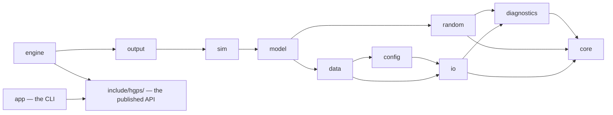

# Design

This document is the architectural contract for this implementation. It is written to be read
before the code: module layout, data flow, the determinism contract and how each part of it is
enforced by the type system rather than by review discipline, the parallelism model, the config v2
format, and the I/O formats.

Every design choice here has a matching Architecture Decision Record in
[docs/decisions/](decisions/). Where a choice came from the upstream baseline or from the earlier
rewrite, the ADR's Context says so.

---

## 1. What this program is

Health-GPS is an agent-based microsimulation of a national population. It builds a synthetic cohort
from survey microdata and demographic projections, ages it one year at a time, evolves each
person's risk factors, applies disease incidence, remission and mortality, and reports aggregated
burden-of-disease statistics.

Its purpose is comparative: a **baseline** future and an **intervention** future are run from the
same seed so that the difference between them is attributable to the policy and not to sampling
noise. That purpose sets the top requirement — **the same config, seed, data and binary must
produce byte-identical output, every run, at any thread count** — because a comparison you cannot
reproduce is not evidence.

---

## 2. Module layout

Ten modules under `src/`, in dependency order. Nothing depends on anything to its right.

```
core ← diagnostics ← random ← io ← config ← data ← model ← sim ← output ← engine
                                                                            ↑
                                                                include/hgps/  ← app
```

`engine` is the top of the library and the only module that implements the published API. `app` is
the command-line host, and it is **not** part of the library: it links `hgps::engine` and sees
`include/hgps/` alone, so an include of anything under `src/` from the CLI is a compile error rather
than a review comment ([ADR 0032](decisions/0032-library-and-a-thin-cli.md)).

More precisely (arrows = "may include"):



### 2.0 The four targets

| Target | What it is | Who links it |
|---|---|---|
| `hgps::engine` | the simulation. Public include path: `include/` only | the CLI, the server, and any other host |
| `hgps::internal` | an interface target adding `src/` to the include path | this project's tests and tools |
| `hgps::server` | the local JSON server over the library | `healthgps`, and `hgps_tests` |
| `hgps::cli` | the argument parser and the console reporter | `healthgps`, and `hgps_tests` |

The split between the first two is what makes the boundary real: the tests opt into the internals by
name, because most of them test one class or one loader, and nothing opts in by accident.
`tests/app/cli_boundary_test.cpp` reads **both hosts'** sources and the published headers and checks
what each includes — CMake enforces it today, and the test is there because a change to a target's
include directories would silently stop enforcing it while everything went on working.

There are two hosts now, and the second one is the point of the first being a library: a contract
with one implementor is a description of that implementor
([ADR 0042](decisions/0042-a-local-server-in-the-same-binary.md)). Both are held to the same rule —
the public API and their own headers, nothing else — and the server matters more, because the server
is where somebody will one day want a number the API does not expose and reaching into `src/` for it
would be one line.

The public API is four calls and three opaque handles; [docs/api.md](api.md) is its contract, and
[docs/server-api.md](server-api.md) is the HTTP contract layered on it. `web/` is a single-page app
over that ([ADR 0043](decisions/0043-a-plain-typescript-frontend.md)); it is served as static files
by the same binary, so the graphical host is one executable and one folder.

| Module | Namespace | Responsibility | Must not |
|---|---|---|---|
| `src/core` | `hgps::core` | Dependency-free primitives: `Identifier`, `DataTable` + typed columns, `Array2D`, `Matrix`, `Interval`, `UnivariateSummary`, `IncomeCategoryLayout`, the plain data types (`Country`, `DiseaseInfo`, `PopulationItem`, …), string and maths helpers, the deterministic parallel helpers. | know about config, data, RNG or models |
| `src/diagnostics` | `hgps::diag` | `InternalError` (programmer error, thrown, carries `std::source_location`) and `InputIssue` / `IssueReport` (user input problems, accumulated, coded, located). | throw for input problems |
| `src/random` | `hgps::rng` | `MtEngine` (MT19937 wrapper, no default constructor), `RandomSource` (the only way to draw), `Categorical<T>` (ordered-only sampling). | be copyable, be default-constructible, be reachable from a parallel region |
| `src/io` | `hgps::io` | Bytes to memory: `CsvReader`, JSON access with located diagnostics, `Sha256`, content-addressed `FileCache`, `DataSource` (directory / zip / URL). | interpret model semantics |
| `src/config` | `hgps::config` | The config v2 document: types, loader, validation, `{TIMESTAMP}` and `${VAR}` expansion, the v1→v2 conversion rules used by `tools/convert-config`. | read the data store |
| `src/data` | `hgps::data` | The back-end data store: `index.json` manifest, per-domain loaders (countries, demographics, diseases, analysis, LMS), disease-registry validation against the directory tree. | know about `Person` |
| `src/model` | `hgps::model` | The simulation's subject matter: `Person`, `Population`, `RuntimeContext`, the five modules (demographic, SES, risk factor, disease, analysis), the risk-factor models, the disease models. | write files |
| `src/sim` | `hgps::sim` | Orchestration: `Scenario` (the baseline and the six interventions), the migration and adjustment journal, the `Engine` that runs one scenario over the horizon, the `Runner` that runs scenarios sequentially, `ModelResult`. | format output |
| `src/output` | `hgps::output` | `ResultCsvWriter`, `RunMetadataJsonWriter`, `IndividualTrackingCsvWriter`. One owner per file, rows in a defined order. | be shared between threads |
| `src/engine` | `hgps::api`, `hgps::engine` | The published API's implementation: the four steps of a run (`session.cpp`), the module wiring (`build_modules.cpp`), the run manifest, the build stamp, and the translation between internal diagnostics and public ones. | write to a stream, or print |
| `src/server` | `hgps::server` | The local JSON server: routes, the run registry and its event buffers, the CSV reduction for charting, and the conversion of public types to the shapes [docs/server-api.md](server-api.md) publishes. Not part of the library. | reach into `src/`, bind anywhere but loopback, or run two simulations at once |
| `src/app` | `hgps::app` | The CLI: command-line options, `serve`'s options, the console reporter, `main`. Not part of the library. | contain model logic, or include anything outside `include/hgps/` and its own directory |

### 2.1 Where the baseline's monoliths went

| Baseline file | Lines | Here |
|---|---:|---|
| `static_linear_model.cpp` | 2,615 | `model/riskfactor/static_linear/` — `model.cpp` (construction and the order the pieces run in), `factors.cpp` (residuals, the two-stage logistic, the inverse Box-Cox), `income.cpp` (sector, both income models, the rank buckets), `physical_activity.cpp`, `policies.cpp`, `trend.cpp` |
| `kevin_hall_model.cpp` | 1,462 | `model/riskfactor/kevin_hall/` — `model.cpp` (lifecycle and the derived expected values), `energy_balance.cpp` (foods to nutrients to energy to a body), `weight_height.cpp` (the quantile curve and the height regression) |
| the five intervention scenarios | 1,183 | `sim/interventions.cpp` — one `BandedInterventionScenario` holding the shape they share, and one virtual function per policy ([ADR 0029](decisions/0029-one-banded-intervention-shape.md)) |
| `model_parser.cpp` | 2,252 | `config/models/` — one unit per model family (`hlm.cpp`, `dynamic_hlm.cpp`, `static_linear.cpp`, `kevin_hall.cpp`) plus `model_loader.cpp` for the shared readers and the name validation |
| `analysis_module.cpp` | 2,202 | `model/analysis/` — `module.cpp` (lifecycle), `burden.cpp` (YLL/YLD/DALY), `channels.cpp`, `series.cpp`, `income_strata.cpp` |
| `datamanager.cpp` | 806 | `data/` — `index.cpp` (the release index and its tokens) and `store.cpp` (the tables, and the disease registry validated against the directory tree) |

About 10,500 lines of the baseline's six largest files become twenty units here, each with a name
that says what it holds. Fifteen of the twenty are under 400 lines; the exceptions are the two
model *loaders*, `config/models/static_linear.cpp` at 1,265 and `kevin_hall.cpp` at 550, and
`data/store.cpp` at 756. Those are long for the same reason in each case — one function per file
shape, and the FINCH and India packs between them ship a lot of file shapes — and splitting them
further would separate a reader from the format they are trying to understand.

Splitting these is the one structural idea taken wholesale from the earlier rewrite
([ADR 0019](decisions/0019-split-the-monolith-translation-units.md)).

### 2.2 The risk-factor model families

Four, in two slots. A run names one static and one dynamic model; the pair must agree about which
factors exist, and load-time validation checks that they do
([ADR 0028](decisions/0028-model-files-resolve-their-own-relative-paths.md)).

| `ModelName` | Slot | What it does | Used by |
|---|---|---|---|
| `HLM` | static | A fitted regression per factor per hierarchy level, with correlated residuals sampled from an empirical distribution. | HLM_France, HLM_India |
| `EBHLM` | dynamic | A per-age-band, per-sex regression on last year's values, with a bounded normal residual. | HLM_France, HLM_India |
| `StaticLinear` | static | A per-factor linear model plus a correlated residual, through an inverse Box-Cox transform, scaled by the expected value. On top: a two-stage logistic first step, income (categorical or continuous), physical activity, sector, and two kinds of time trend. | KevinHall_FINCH, KevinHall_India (which loads but cannot run — [docs/examples.md](examples.md)) |
| `KevinHall` | dynamic | The energy balance: foods to nutrients to energy intake, and the change in intake moves fat, lean tissue, glycogen and fluid to a new steady state, from which weight and BMI follow. | KevinHall_FINCH, KevinHall_India |

`StaticLinear` reads its per-factor parameters in either of two shapes, because both are in use
upstream: a set of **CSV matrices** whose rows are predictors and columns are risk factors (FINCH),
or a **JSON object per factor** (India). The factor order is the correlation matrix's column order
in both, and it is load-bearing — the Cholesky factor and every per-factor vector are indexed by
it, so a different order is a different model.

Neither family's model is given a 31-argument constructor. Each takes one `shared_ptr<const
Parameters>` whose fields are named at the call site and validated in one place
([ADR 0029](decisions/0029-one-banded-intervention-shape.md)).

**Which model family sees an intervention.** Only `EBHLM`. `Scenario::apply` — the call that offers
a person and a risk factor to the active policy — has exactly one call site here
(`model/riskfactor/hlm_model.cpp`), and exactly one in the baseline
(`dynamic_hierarchical_linear_model.cpp:110`). Neither `StaticLinear` nor `KevinHall` calls it, so
on the FINCH surface **all six intervention scenarios are inert**, in both implementations and
measurably so ([docs/equivalence.md](equivalence.md)). That surface has its own policy mechanism
instead: `modelling.policy_start_year`, from which the static linear model applies the policy-effect
coefficients and the residual policy covariance to the intervention scenario. The two mechanisms
are unrelated, and a config can select either without the other.

---

## 3. Data flow

```mermaid
sequenceDiagram
    autonumber
    participant U as User
    participant APP as app/main
    participant CFG as config::load
    participant DS as io::DataSource
    participant D as data::Store
    participant MP as config::models
    participant R as sim::Runner
    participant E as sim::Engine
    participant W as output writers

    U->>APP: healthgps --config config.json
    APP->>CFG: load(path, report)
    CFG->>CFG: parse, validate, expand ${VAR}
    CFG-->>APP: Config v2 + IssueReport
    Note over APP: any issue of level error → print all, exit 2
    APP->>DS: resolve(config.data)
    DS->>DS: directory → use; zip → verify SHA-256, extract to cache;<br/>URL → download, verify SHA-256 (required), extract to cache
    DS-->>APP: data directory
    APP->>D: Store(data_dir, report)
    D->>D: read index.json; validate disease registry against the tree
    APP->>D: country(code), diseases(selected)
    APP->>MP: load static + dynamic model definitions (report)
    Note over MP: every predictor name checked against the<br/>registered factor set — unknown name = input issue
    APP->>APP: load input dataset CSV → core::DataTable
    Note over APP: --dry-run stops here, after all validation
    APP->>W: open writers (single owner each)
    APP->>R: Runner(config, seed)
    loop trial run 1..N
        R->>E: run(Baseline, run, run_seed)
        E-->>R: results + migration journal
        R->>E: run(Intervention, run, run_seed, journal)
        E-->>R: results
        R->>W: write(baseline rows), then write(intervention rows)
    end
    APP->>W: close
    APP-->>U: elapsed, output paths, seed used
```

Two things about this flow are deliberate and differ from the baseline:

**All validation happens before any simulation.** Config, model definitions, the data index and the
disease registry are fully validated and every problem is reported together, before the first
random draw. The baseline discovers problems one per run.

**Scenarios run one after the other**, and the baseline's net-migration numbers are recorded in a
*migration journal* that the intervention replays. The baseline instead runs the two scenarios
concurrently and passes those numbers over a `SyncChannel` with a timeout. The journal is
deterministic, needs no timeout, and removes the config key `sync_timeout_ms` entirely
([ADR 0009](decisions/0009-sequential-scenarios-and-the-migration-journal.md)).

---

## 4. The determinism contract

> Same config + same seed + same data + same binary ⇒ byte-identical CSV output, every run,
> regardless of thread count.

Bit-exact agreement with the *baseline* is explicitly **not** promised, and neither is
bit-reproducibility across platforms or compilers ([ADR 0006](decisions/0006-validation-strategy.md)).
What is promised is the above, and it is tested: `tests/sim/reproducibility_test.cpp` runs a
simulation twice, and at one thread and at N threads, and compares the output files byte for byte.

Each clause below is enforced by a mechanism, not by a convention. "Enforced by" names the thing
that makes the mistake fail to compile, or fail loudly at runtime, rather than produce a plausible
wrong number.

| # | Rule | Enforced by |
|---|---|---|
| D1 | No run is unseeded | `MtEngine` has no default constructor and no `seed()` setter; it is constructible only from `std::uint32_t`. `config::Running::seed` is a **required scalar**. There is no code path that reaches `std::random_device`. |
| D2 | An RNG handle cannot be copied, moved or shared between threads | `RandomSource` deletes its copy and move operations and has no default constructor. It is reachable only as `RuntimeContext::random()` returning a non-const reference. |
| D3 | No RNG draw happens inside a parallel region | The parallel helpers in `core/parallel.h` take a callable invoked with an index (or an element reference) and nothing else — there is no way to receive an RNG handle from the helper. In addition every `RandomSource` draw asserts `!core::parallel::in_parallel_region()` and throws `InternalError` if it is, on every worker thread and on the calling thread. A capture that smuggles the handle in therefore fails on its first draw, deterministically, with a source location. Tested by `tests/random/parallel_guard_test.cpp`. |
| D4 | No probability distribution is built by iterating an unordered container | `Categorical<T>` is constructible only from an ordered sequence (`std::span<const std::pair<T, double>>` or `(std::span<const T>, std::span<const double>)`). Constructors taking `std::unordered_map` / `std::unordered_set` are **declared and deleted**, so passing one is a compile error naming the rule. Nothing else in the tree walks a CDF. |
| D5 | Reductions over the population have a fixed order | `core::parallel::reduce_ordered` splits `[0, n)` into a number of blocks fixed by `n` and the block size — *not* by the thread count — accumulates each block in ascending index order, and combines the per-block partials in ascending block order. The result is identical for any thread count. There is no mutex-guarded `+=` anywhere. |
| D6 | Integer sampling is unbiased and in range | `RandomSource::next_int(lower, upper)` samples by rejection from the engine's raw output — never `%`, never a float multiply. The contract is documented **half-open** where it takes a count, and the inclusive-range overload is named `next_int_inclusive`. Tested by `tests/random/modulo_bias_test.cpp`. |
| D7 | Uniform doubles do not depend on the library's `generate_canonical` | `RandomSource::next_double()` builds a `double` explicitly from 53 random bits: `(hi53 >> 11) * 2^-53`, giving a value in `[0, 1)` by construction. `std::generate_canonical` is not used anywhere. |
| D8 | Sampling contracts reject their degenerate inputs | The polar-method normal draw rejects `p == 0.0` as well as `p >= 1.0`; empirical-discrete sampling rejects empty input with an `InternalError`; `Interval` rejects `lower > upper`. |
| D9 | Person identity is stable for the lifetime of a run | `Population` hands out IDs from a monotonically increasing counter that never reuses a value, and the initial cohort takes IDs `1..N` **by index**, so person *k* in the baseline is person *k* in the intervention. Recycling applies to storage slots only, tracked by an explicit free-slot list. |
| D10 | Output rows have a defined order | Each output file has exactly one owner object, which is not shared between threads. The runner hands it whole scenario result sets in scenario order, and the writer emits rows sorted by `(source, run, time, gender, index_id)`. |
| D11 | Scenarios do not race | `Runner` runs scenarios sequentially. There is no `SyncChannel`, no `std::jthread` per scenario and no timeout. |
| D12 | Character handling is defined | Every `<cctype>` call goes through `core::chars::` wrappers that take `char` and cast to `unsigned char` internally. The raw functions are not called anywhere else; a clang-tidy check and a grep test enforce it. |
| D13 | Identity and ordering agree | `Identifier::operator==` compares the string. The 64-bit hash exists only as `std::hash<Identifier>` for `unordered_map` bucketing. |
| D14 | The seed recorded is the seed used | The run metadata JSON records the master seed as a scalar and each trial run's derived seed. There is no `value_or(0)` anywhere near a seed. |

What is *not* claimed: identical results across compilers or platforms. `-ffp-contract=off` is set
so a compiler may not silently fuse `a*b+c`, which removes the largest single source of
platform-to-platform drift, but nothing here pins libm, and `std::exp`/`std::log` results are
allowed to differ in the last bit between C libraries.

### 4.1 Where randomness enters

One `RandomSource` per `RuntimeContext`, i.e. one stream per scenario run, re-seeded at the start
of each run from the run seed. Modules consume it in a fixed order:

```
Demographic → SES → RiskFactor(static | dynamic) → Disease → Analysis
```

That order is the same as the baseline's, and it is fixed in code rather than configured. Both
scenarios of a trial run receive the *same* run seed — common random numbers — which is what makes
the baseline-versus-intervention difference attributable to the policy.

The run seed for trial *r* is derived from the master seed by a documented, platform-independent
function (`rng::derive_run_seed`) rather than by drawing from a master engine, so adding a trial run
does not change the seeds of the runs before it.

---

## 5. Parallelism model

Sequential by default. Parallelism is opt-in, per site, and only where it cannot affect results.

| Layer | Policy |
|---|---|
| Trial runs | Sequential. |
| Scenarios within a run | **Sequential**, always. Not configurable. |
| Population sweeps that draw randomness | **Serial**, always. Enforced as D3. |
| Population sweeps that are pure functions of person state | May use `core::parallel::for_each_index`. The callable receives an index and may not touch the RNG. |
| Reductions over the population | `core::parallel::reduce_ordered` only — fixed block decomposition, fixed combine order (D5). |
| Output | Single-owner writers on the calling thread (D10). |

`core/parallel.h` is the only place in the tree that creates a thread. It uses a small fixed-size
`std::thread` pool sized from `--threads` (default: hardware concurrency, capped), and it sets the
`in_parallel_region` thread-local flag on every worker **and** on the calling thread for the
duration of the region, which is what makes D3 detectable.

The audit measured that the baseline gained essentially nothing from its threading — 37 s at one
thread versus 39 s at ten — because a global mutex serialised each parallel loop body
(`docs/audit/00-inventory.md` §4.6). So the default here is one thread, and
`docs/performance.md` reports what the parallel sites actually buy.

---

## 6. Diagnostics

Two kinds of problem, two mechanisms. This split is the best idea in the earlier rewrite and is
carried forward and extended ([ADR 0007](decisions/0007-two-tier-diagnostics.md)).

**`diag::InternalError`** — a programmer error: a broken invariant, an impossible state, a contract
violation by a caller inside this codebase. Thrown. Carries `std::source_location`. Never caught
except at the top of `main`, where it prints file, line, function and message and exits 70. There
are no `catch (...)` blocks and no `catch (const std::exception &)` that continue.

**`diag::InputIssue`** — something wrong with what the *user* supplied. Accumulated into a
`diag::IssueReport`, never thrown. Each issue carries:

| Field | Meaning |
|---|---|
| `level` | `error` (the run cannot proceed) or `warning` (it can, and here is what was assumed) |
| `code` | a value of the closed `diag::IssueCode` enum, e.g. `config_missing_required`, `data_disease_not_in_tree`, `model_unknown_predictor`, `csv_bad_value` |
| `location` | optional file path, JSON pointer or CSV field name, line, column |
| `message` | one sentence, stating what was found and what was expected |

The report is threaded through config loading, model JSON loading, CSV loading and data-index
resolution **from day one** — the places the earlier rewrite's version did not reach. The user sees
every problem in one pass, each one located:

```
error  [config_unknown_property]     france.json:34:5 (/running/sync_timeout_ms)
       unknown property 'sync_timeout_ms'; it was removed in config v2 — delete it
error  [model_unknown_predictor]     static_model.json (/RiskFactorModels/boxcox_coefficients)
       predictor 'Enegry' is not a known risk factor or derived predictor; did you mean 'Energy'?
2 errors, 0 warnings
```

A missing key is never silently defaulted. Where a default exists it is documented in the schema,
applied explicitly, and reported as a `warning` the first time it is used.

---

## 7. Config v2

The format lives in [`schemas/v2/`](../schemas/v2) and is identified by its `$schema`, which points
at this repository. `tools/convert-config` reads an upstream v1 config — both the `config.json` and
the `new_config.json` variants — and emits v2 ([ADR 0010](decisions/0010-config-v2-and-a-converter.md)).

Differences from upstream v1, all ruled:

| Change | Why |
|---|---|
| `project_requirements` is **required**, with every sub-block's defaults documented in the schema | Upstream gates most current behaviour on this block, and no upstream primary `config.json` carries it (audit D-03). Requiring it makes the active code path explicit instead of accidental. |
| `running.seed` is a **required scalar integer** (was an optional 0-or-1-element array) | An unseeded run is not a thing this program can do (audit B-06, D1). |
| `sync_timeout_ms` is **removed**; its presence is an error naming the replacement | Scenarios are sequential; there is nothing to time out (ADR 0009). |
| `output.file_name` is used **exactly as configured**; `{TIMESTAMP}` is an optional token | Upstream ignores the configured name unless it contains a token (audit B-08), and a mandatory timestamp obstructs regression testing. |
| `version` is kept, `const 2` | Cheap, and it makes a hand-written config's intent explicit. |
| `additionalProperties: false` everywhere | An unknown or misspelled key is an input issue, not a silent no-op. |
| `data.checksum` is **required** when `data.source` is a URL or a zip | Fetching unverified model inputs over the network is not acceptable provenance (ADR 0011). |
| `population_impact_fraction` is accepted but rejected at load with `feature_not_implemented` if `enabled` | PIF is out of scope for this run; the config shape is reserved so it slots in later. |

Everything else keeps its v1 shape and spelling, so conversion is mechanical and a reader who knows
the upstream format knows this one.

### 7.1 Shape

```jsonc
{
  "$schema": "schemas/v2/config.json",
  "version": 2,
  "project_requirements": { "demographics": {…}, "income": {…}, "physical_activity": {…},
                            "risk_factors": {…}, "trend": {…}, "two_stage": {…} },
  "data":      { "source": "<dir | .zip | https URL>", "checksum": "<sha256, required for zip/URL>" },
  "inputs":    { "dataset": { "name": …, "format": "csv", "delimiter": ",", "encoding": "ASCII",
                              "columns": { "<name>": "integer|double" } },
                 "settings": { "country_code": "FRA", "size_fraction": 0.0001, "age_range": [0, 100] } },
  "modelling": { "ses_model": { "function_name": "normal", "function_parameters": [0.0, 1.0] },
                 "policy_start_year": 2024,
                 "risk_factors": [ { "name": …, "level": 0, "range": [lo, hi] } ],
                 "risk_factor_models": { "static": "static_model.json", "dynamic": "dynamic_model.json" },
                 "baseline_adjustments": {…},
                 "demographic_models": {…} },
  "running":   { "seed": 123456789, "start_time": 2010, "stop_time": 2050, "trial_runs": 1,
                 "diseases": [ … ],
                 "interventions": { "active_type_id": null | "simple" | "marketing" |
                                    "dynamic_marketing" | "fiscal" | "physical_activity" |
                                    "food_labelling",
                                    "types": { … } } },
  "output":    { "comorbidities": 5, "folder": "…", "file_name": "result.csv",
                 "individual_id_tracking": {…} }
}
```

`${VAR}` expansion applies to `output.folder` and `data.source`; an undefined variable is an
**error**, not an empty string (upstream expands it silently — audit N-17).

---

## 8. Data store

The store is a directory tree described by `index.json`, exactly as upstream, so the existing
`hgps_main_data` checkout and the released data zips can be read unchanged. Paths are built by
token substitution (`{COUNTRY_CODE}`, `{DISEASE_TYPE}`, `{GENDER}`, `{RISK_FACTOR}`).

Three things are new:

1. **The disease registry is validated against the directory tree at load time.** Every entry in
   `diseases/Metadata.json` must have a directory, and every disease directory must have an entry.
   Each mismatch is an input issue with the offending name and path. This is what makes the
   upstream `pulmonar` / `pulmonary` inconsistency (audit D-01) a diagnostic instead of a
   mid-run failure. The canonical spelling here is **`pulmonary`**, matching the directory
   ([ADR 0012](decisions/0012-disease-naming-pulmonary.md)).
2. **A URL or zip source requires a SHA-256 checksum** and is cached content-addressed under
   `<cache>/data/<sha[0:2]>/<sha[2:]>/`. A checksum mismatch is an error that names both hashes.
3. **Nothing is vendored.** The CC BY-NC-ND disease data is fetched on demand. For offline runs and
   CI there is a small **synthetic** data pack under `tests/fixtures/`, generated by
   `tools/gen-fixtures`, in the same layout, carrying a `SYNTHETIC.md` that says so
   ([ADR 0011](decisions/0011-data-fetched-not-vendored.md)).

---

## 9. I/O formats

### Inputs

| Input | Format | Read by |
|---|---|---|
| Config | JSON (config v2) | `config::load` |
| Static / dynamic risk-factor model definitions | JSON + referenced CSVs | `config::models::*` |
| Input dataset (survey microdata) | CSV, typed by `inputs.dataset.columns` | `io::CsvReader` → `core::DataTable` |
| Data store | directory tree + `index.json` | `data::Store` |
| FactorsMean adjustment tables | CSV | `model::riskfactor::AdjustableModel` |

### Outputs

Written into `output.folder`, named from `output.file_name` (its stem; the extension is by file
kind):

| File | Content |
|---|---|
| `<name>.csv` | the main result table: one row per `(source, run, time, gender, index_id)`, with count, deaths, emigrations and mean/std for every risk factor and disease measure |
| `<name>.json` | run metadata: program version, config path and SHA-256, country, horizon, trial runs, **the master seed and each run's derived seed**, wall-clock start and end, and the result series |
| `<name>_<IncomeCategory>.csv` | the same table stratified by income category, when `project_requirements.income.income_based_csv_output` is set |
| `<name>_IndividualIDTracking.csv` | optional per-person rows, filtered by `output.individual_id_tracking` |

CSV output is written with `std::format`-based fixed formatting (`{:.10g}`) so that a value's text
does not depend on the platform's locale or on iostream state, and rows are emitted in the order
given by D10. Ten digits, not the baseline's six: the baseline writes to a `std::stringstream` at
its default precision, which is the reason the equivalence comparison needs a 10⁻⁵ floor
([docs/equivalence.md](equivalence.md)).

**Which columns exist** is a property of the configuration and the loaded models, decided before
the run starts — never of the population. A demographic channel is written when
`project_requirements` asks for the dimension **and** a loaded risk-factor model declares that it
assigns it (`model::AssignedAttributes`). Both halves are needed: the requirement defaults switch
income and physical activity on for every config including the HLM ones, whose models assign
neither, and the baseline decides by inspecting the first 1,000 people — so its file's column set
depends on the contents of a sample of the cohort, and a small cohort can lose a column
altogether. The risk-factor and disease columns come from the config's declared factor list and
disease list, in the config's own order.

---

## 10. Testing

Five layers, all under `tests/`, all registered with CTest.

| Layer | What it is |
|---|---|
| Ported baseline tests | The baseline's 471 tests, adapted to this API, each preserving its intent and expected values. Where a baseline test encodes a baseline bug from `docs/audit/04-baseline-issues.md`, the expectation is changed and the finding ID is named in a comment. |
| Tests the baseline lacks | Byte-for-byte reproducibility (twice, and 1 vs N threads); modulo-bias regression; ordered-sampling; unseeded-config rejection; RNG-in-parallel-region rejection; disease-registry mismatch diagnostics. |
| Fixture-dependent tests | The 35 baseline tests that skip on a missing FINCH pack point at the synthetic fixture pack or the real upstream FINCH example, and **fail** rather than skip when it is missing. Thirty of them now run and pass; the five that do not assert the contents of console tables this build does not print ([docs/test-port-map.md](test-port-map.md)). |
| Equivalence harness | `tests/equivalence/run.py` — runs the baseline and this implementation on the same converted configs across ≥20 seeds and compares output distributions within documented tolerances (`docs/equivalence.md`). Three examples — `HLM_France`, `KevinHall_FINCH`, and `HLM_India` at a reduced cohort — and each of the six interventions on its own. Not part of the default CTest run — it needs the baseline binary and about twenty minutes — and driven by `scripts/check.sh`, which uses the checked-in references rather than the baseline binary. There is **no failure budget**: any out-of-tolerance comparison fails ([ADR 0027](decisions/0027-equivalence-excludes-the-bands-only-one-side-fills.md)). |
| The harness's own tests | `tests/equivalence/run_test.py`, registered as `EquivalenceHarness.Rules` and part of the ordinary CTest run, plus `self_check.py` as two more entries that run the harness against this build twice over. The harness decides whether this implementation agrees with the baseline, so a mistake in it says PASS rather than producing a wrong number — and two of its statistical rules have been wrong once each, both found by a twenty-minute run rather than by anything cheap. These check Fisher's exact test, the type-7 quantiles, the printed-precision bucketing, the count-weighted reduction, the lattice rule, and — since [ADR 0039](decisions/0039-scratch-directories-copy-what-they-may-write.md) — that a staged working directory cannot write back into the example it was staged from, in milliseconds. |

`scripts/check.sh` configures and builds every preset, runs the tests, runs the equivalence harness,
and fails on the first error. `.github/workflows/ci.yml` is the same work split across jobs — four
presets on `ubuntu-latest` and `macos-latest`, Linux with both clang and GCC, and the harness against
the checked-in references — and does not build the baseline.

---

## 11. Toolchain

C++20. CMake ≥ 3.24 with presets `release`, `debug`, `asan-ubsan`, `tsan`. vcpkg in manifest mode
pinned to a `builtin-baseline`. GoogleTest, which is what the baseline uses, so the ports stay
close.

Dependencies are deliberately few — `fmt`, `nlohmann-json`, `gtest` — because the audit's single
biggest build obstacle was the baseline's dependency set (openssl and curlpp failing to configure
under a current CMake). SHA-256, CSV parsing, the dense matrix and its Cholesky decomposition are
implemented here; HTTP download and zip extraction are delegated to the `curl` and `unzip`
executables, with the checksum verified by our own code
([ADR 0014](decisions/0014-minimal-dependency-set.md)).

Warnings are `-Wall -Wextra -Wpedantic -Werror` in this project's own code. Every warning is fixed,
not suppressed. `-ffp-contract=off` is set for all targets.
